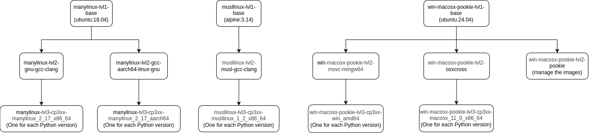

# pookie

Tool for Automating the Build and Testing Process of Native Python Libraries Using Cross-Compilation and Emulation Technologies.

## About the Project

This project focuses on developing an Open Source application to optimize the building and testing of Python libraries that include low-level code in C and C++. These libraries, crucial for data-intensive tasks, require specific compilation processes to ensure performance and portability across different operating systems and architectures.

The proposed solution leverages technologies like QEMU and Wine to implement cross-compilation and emulation, enabling efficient binary generation without the time and resource limitations of commercial continuous integration platforms. This project aims to enhance accessibility and efficiency in the development of scientific and computational software.

## Prerequisites

Before getting started, ensure you have the following installed and configured on your system:

1. **Docker**:

   Install Docker by following the official installation guide for your operating system: [Docker Installation Guide](https://docs.docker.com/get-docker/). Verify Docker is installed correctly by running:

    ```bash
    docker --version
    ```

    To run Docker without `sudo`, add your user to the Docker group:

    ```bash
    sudo usermod -aG docker $USER
    ```

    Log out and back in for the changes to take effect.

3. **Disk Space**:

    Ensure sufficient disk space for Docker images and containers. Check current usage with:

    ```bash
    docker system df
    ```

4. **Internet Connection**:

    Required to download python and dependencies during the Docker images building process.

## Quick Start

1. **Grant Execution Permissions**:

   Ensure the `pookie.sh` script has execution permissions. Run the following command:

   ```bash
   chmod +x pookie.sh
   ```

2. **Run Pookie**:

    Execute the `pookie.sh` script to run pookie. Yo have to provide the `workspace` directory as an argument. This directory tipically is the directory of the project you want to build.

    ```bash
    ./pookie.sh --workspace /path/to/workspace --help
    ```

## Running pookie: Command Line Options

> **Note:** Searching for Python versions on python.org and creating Docker images can take some time. It is recommended to first run pookie without the `--build` and `--test` options to generate the required images for the specified Python versions and targets. Once the images are created, you can run the `build` and `test` commands as needed, which will execute much faster.

> **Note:** In `--build` and `--test` bash commands you can use python or python3, pip or pip3.

| Argument                                                                                               | Description                                                                 |
|--------------------------------------------------------------------------------------------------------|-----------------------------------------------------------------------------|
| `-h, --help`                                                                                           | Show this help message and exit                                             |
| `--build BUILD`                                                                                        | Python build bash command                                                   |
| `--test TEST`                                                                                          | Python test bash command                                                    |
| `--python-version PYTHON_VERSION [PYTHON_VERSION ...]`                                                 | Minor Python version(s) to compile for (if not specified: last 4 available) |
| `--target {manylinux_2_17_x86_64,musllinux_1_2_x86_64,win_amd64,macosx_11_0_x86_64} [{manylinux_2_17_x86_64,musllinux_1_2_x86_64,win_amd64,macosx_11_0_x86_64} ...]` | Target platform(s) to build and test the library for (if not specified: all) |

## Examples

Build the native Python library `mylib` and test it with `test.py` script for Python minor versions `11` and `10` for all targets.

```bash
./pookie.sh \
    --workspace /path/to/mylib \
    --build "python3 -m pip install setuptools build wheel && python3 -m build" \
    --test "python3 test.py" \
    --python-version 11 10
```

Build the native Python library `mylib` and test it with test files in the module `tests` (directory with `__init__.py`) for the last 4 available Python minor versions targeting both `manylinux_2_17_x86_64` and `musllinux_1_2_x86_64`.

```bash
./pookie.sh \
    --workspace /path/to/mylib \
    --build "pip install setuptools build wheel && python3 -m build" \
    --test "python -m tests" \
    --target manylinux_2_17_x86_64 musllinux_1_2_x86_64
```

Build the native Python library `mylib` and test it with `pytest` on the test files on `tests` directory for `13` Python minor version targeting both `win_amd64`.

```bash
./pookie.sh \
    --workspace /path/to/mylib \
    --build "pip3 install setuptools build wheel && python -m build" \
    --test "python -m pip install pytest && python -m pytest tests" \
    --python-version 13 \
    --target win_amd64
```

## Output

Build artifacts will be placed inside the `dist` directory.

## Docker Layer Graph

Below is a visual representation of the Docker layer graph used by pookie. This graph illustrates the structure and relationships between the layers of the Docker images.



This graph can help you understand how the images are built and how layers are shared across different targets.

## Developer Notes

During development, if you're rebuilding images frequently (for example, when testing changes) Docker may retain old layers from previous builds. Even when images are overwritten, the old layers can remain in the cache and gradually consume a large amount of disk space.

To check current Docker disk usage:

```bash
docker system df
```

To safely clean up dangling images and unused build cache:

```bash
docker image prune

docker builder prune
```

This will only remove dangling images (those that are untagged and not referenced by any container) and build cache not currently used by any active images or containers, helping to free up disk space without affecting running or tagged images.

## License

This project is open source and available under the terms of the  
[GNU General Public License v3.0](https://www.gnu.org/licenses/gpl-3.0.html).  
See the [LICENSE](LICENSE) file for the full text.

---

I hope this guide has been helpful!
