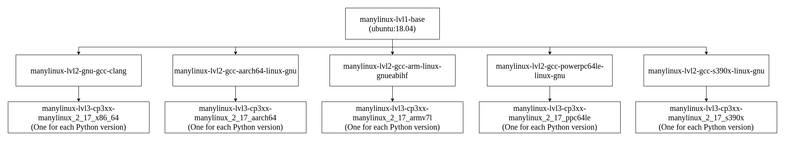
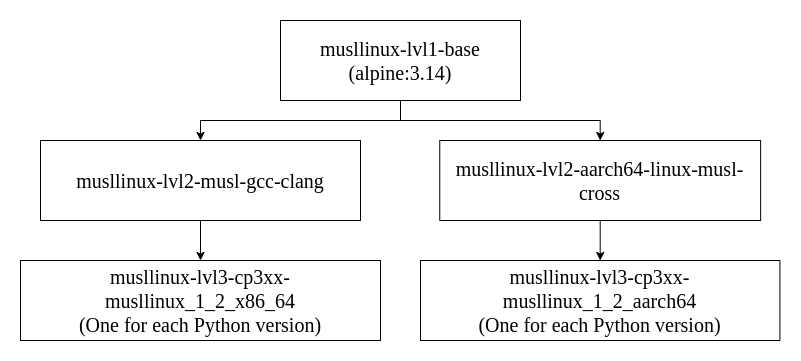
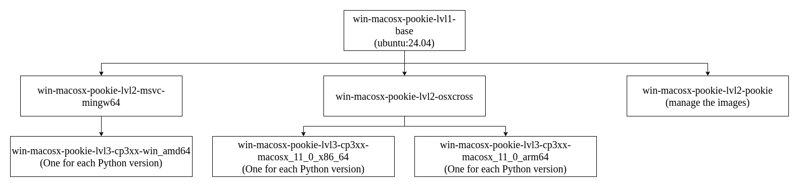

# pookie

Tool for Automating the Build and Testing Process of Native Python Libraries Using Cross-Compilation and Emulation Technologies.

## About the Project

This project focuses on developing an Open Source application to optimize the building and testing of Python libraries that include low-level code in C and C++. These libraries, crucial for data-intensive tasks, require specific compilation processes to ensure performance and portability across different operating systems and architectures.

The proposed solution leverages technologies like QEMU and Wine to implement cross-compilation and emulation, enabling efficient binary generation without the time and resource limitations of commercial continuous integration platforms. This project aims to enhance accessibility and efficiency in the development of scientific and computational software.

## Prerequisites

Before getting started, ensure you have the following installed and configured on your system:

1. **Docker**:

   Install Docker by following the official installation guide for your operating system: [Docker Installation Guide](https://docs.docker.com/get-docker/). Verify Docker is installed correctly by running:

    ```bash
    docker --version
    ```

    To run Docker without `sudo`, add your user to the Docker group:

    ```bash
    sudo usermod -aG docker $USER
    ```

    Log out and back in for the changes to take effect.

3. **Disk Space**:

    Ensure sufficient disk space for Docker images and containers. Check current usage with:

    ```bash
    docker system df
    ```

4. **Internet Connection**:

    Required to download python and dependencies during the Docker images building process.

## Quick Start

1. **Grant Execution Permissions**:

   Ensure the `pookie.sh` script has execution permissions. Run the following command:

   ```bash
   chmod +x pookie.sh
   ```

2. **Run pookie**:

    Execute the `pookie.sh` script to run pookie. Yo have to provide the `workspace` directory as an argument (use absolute path). This directory tipically is the directory of the project you want to build.

    ```bash
    ./pookie.sh --workspace /path/to/workspace --help
    ```

## Running pookie: Command Line Options

> **Note:** Searching for Python build standalone and creating Docker images can take some time. It is recommended to first run pookie without the `--build` and `--test` options to generate the required images for the specified Python versions and targets. Once the images are created, you can run the `build` and `test` commands as needed, which will execute much faster.

> **Note:** The environments provided by the tool only come with Python and pip pre-installed. In `--build` and `--test` bash commands you can use python or python3, pip or pip3. If you want to use any additional packages (for example, setuptools, wheel, build, pytest, poetry, etc.), you need to specify their installation using pip within the `--build` or `--test` command. Additionally, it is recommended to run these modules using `python -m <module>` rather than just calling the module name directly.

| Argument | Description |
| - | - |
| `-h, --help` | Show this help message and exit |
| `--clean` | Remove all build artifacts and end the script execution |
| `--build BUILD` | Python build bash command |
| `--test TEST` | Python test bash command |
| `--python-version PYTHON_VERSION [PYTHON_VERSION ...]` | Minor Python version(s) to compile for (default: last 4 available) |
| `--target {manylinux_2_17_x86_64,manylinux_2_17_aarch64,manylinux_2_17_armv7l,`<br>`musllinux_1_2_x86_64,musllinux_1_2_aarch64,win_amd64,macosx_11_0_x86_64,macosx_11_0_arm64} [{manylinux_2_17_x86_64,manylinux_2_17_aarch64,manylinux_2_17_armv7l,`<br>`musllinux_1_2_x86_64,musllinux_1_2_aarch64,win_amd64,macosx_11_0_x86_64,macosx_11_0_arm64} ...]` | Target platform(s) to build and test the library for (default: all) |
| `--linux-x86_64-compiler {gcc,clang}` | Compiler to use for manylinux_2_17_x86_64 or musllinux_1_2_x86_64 targets (default: gcc) |
| `--linux-non-native-mode {cross,emulate}` | Compilation mode for non-native manylinux_2_17 targets (e.g. aarch64, armv7l, ppc64, riscv64, s390x): "cross" for cross-compilation or "emulate" for QEMU-based emulation (default: cross) |

## Examples

Build the native Python library `mylib` and test it with `test.py` script for Python minor versions `11` and `10` for all targets.

```bash
./pookie.sh \
    --workspace /path/to/mylib \
    --build "python3 -m pip install setuptools build wheel && python3 -m build" \
    --test "python3 test.py" \
    --python-version 11 10
```

Build the native Python library `mylib` with `clang`and test it with test files in the module `tests` (directory with `__init__.py`) for the last 4 available Python minor versions targeting both `manylinux_2_17_x86_64` and `musllinux_1_2_x86_64`.

```bash
./pookie.sh \
    --workspace /path/to/mylib \
    --build "pip install setuptools build wheel && python3 -m build" \
    --test "python -m tests" \
    --target manylinux_2_17_x86_64 musllinux_1_2_x86_64 \
    --linux-x86_64-compiler clang
```

Build the native Python library `mylib` and test it with `pytest` on the test files on `tests` directory for `13` Python minor version targeting `win_amd64`.

```bash
./pookie.sh \
    --workspace /path/to/mylib \
    --build "pip3 install setuptools build wheel && python -m build" \
    --test "python -m pip install pytest && python -m pytest tests" \
    --python-version 13 \
    --target win_amd64
```

## Output

Build artifacts will be placed inside the `dist` directory.

## Test pookie
To test the functionality of pookie, you can run the provided test script `test_pookie.sh`. This script will execute a series of tests to ensure that pookie is functioning correctly and that the Docker images are built and run as expected.

1. **Grant Execution Permissions**:

   Ensure the `test_pookie.sh` script has execution permissions. Run the following command:

   ```bash
   chmod +x test_pookie.sh
   ```

2. ** Run the test script**:

   Execute the `test_pookie.sh` script to run the tests.

   ```bash
   ./test_pookie.sh \
        --workspace /path/to/workspace \
        --build <build_command> \
        --test <test_command> \
   ```

## Docker Layer Graph

Below is a visual representation of the Docker layer graph used by pookie. This graph illustrates the structure and relationships between the layers of the Docker images. This graph can help you understand how the images are built and how layers are shared across different targets.







## Project Structure

The repository is organized as follows:

```
pookie/
├── images/                                    # Dockerfiles for building cross-platform environments
│ ├── manylinux/                                   # Dockerfiles targeting manylinux-based builds
│ ├── musllinux/                                   # Dockerfiles targeting musllinux-based builds
│ ├── win-macosx-pookie/                           # Dockerfiles for Windows and macOS cross-compilation
│ └── Docker_layer_graph.drawio                    # Editable Docker layer diagram
├── src/                                       # Python scripts for building and running images
│ ├── docker_images_builder.py                     # Python script for building Docker images following the layer graph
│ ├── docker_images_runner.py                      # Python script for running build and test commands on Docker images
│ ├── pookie.py                                    # Python script for managing the user arguments
│ └── python_version_fetcher.py                    # Python script for fetching available Python versions
├── pookie.sh                                  # Shell script for lunching pookie
├── test_pookie.sh                             # Shell script for testing pookie functionality
├── LICENSE                                    # Project license
├── .gitignore                                 # Git ignore rules
├── .gitattributes                             # Git attributes config
└── README.md                                  # Project documentation
```

## Developer Notes

During development, if you're rebuilding images frequently (for example, when testing changes) Docker may retain old layers from previous builds. Even when images are overwritten, the old layers can remain in the cache and gradually consume a large amount of disk space.

To check current Docker disk usage:

```bash
docker system df
```

To safely clean up dangling images and unused build cache:

```bash
docker image prune

docker builder prune
```

This will only remove dangling images (those that are untagged and not referenced by any container) and build cache not currently used by any active images or containers, helping to free up disk space without affecting running or tagged images.

## License

This project is open source and available under the terms of the [GNU General Public License v3.0](https://www.gnu.org/licenses/gpl-3.0.html).
See the [LICENSE](LICENSE) file for the full text.

---

I hope this guide has been helpful!
