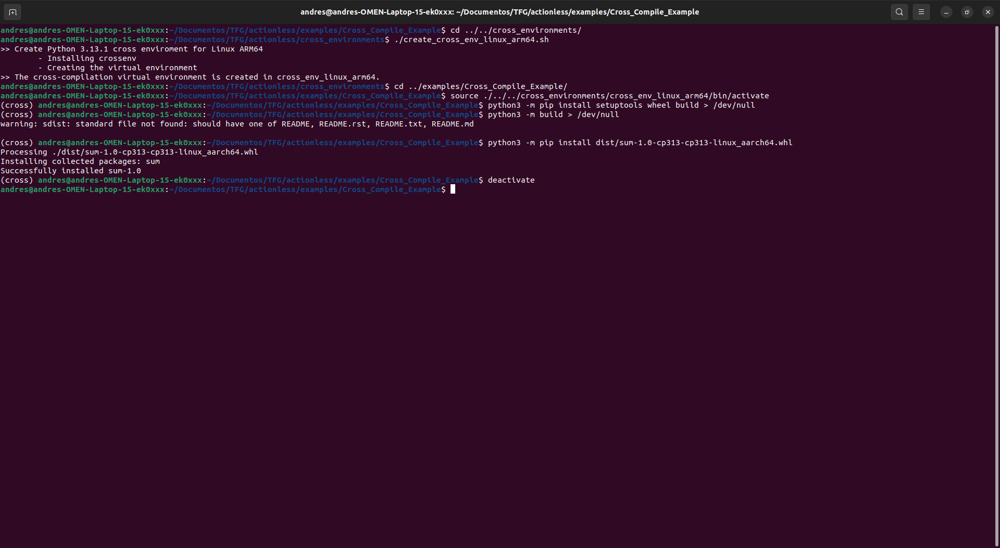

# Example of Compiling a Python Package in C with Cross-Compilation for Linux ARM64

## Navigate to the cross environments directory
```bash
cd ../../cross_environments/
```

## Create the cross environment
Run the script to create a virtual cross-compilation environment:
```bash
./create_cross_env_linux_arm64.sh
```

## Activate the virtual environment
```bash
cd ../examples/Cross_Compile_Example/
source ../../cross_environments/cross_env_linux_arm64/bin/activate
```

## Set up build tools
Install `setuptools` and `wheel`:
```bash
python3 -m pip install setuptools wheel build
```

## Build the package
Build the package from the source:
```bash
python3 -m build
```

## Install the generated package
Install the `.whl` package that was generated:
```bash
python3 -m pip install dist/sum-1.0-cp313-cp313-linux_aarch64.whl
```

## Deactivate the virtual environment
Once finished, deactivate the environment:
```bash
deactivate
```

## Screenshot of the Example

