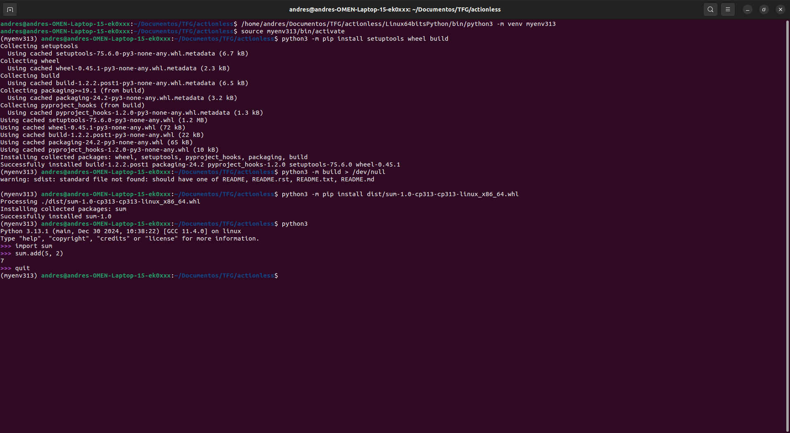

# Ejemplo de compilación de un paquete de Python en C sin compilación cruzada

## 1. **Creación de un entorno virtual**
Esto es opcional, pero recomendado para evitar conflictos con otros paquetes instalados en el sistema.

Primero, creamos y activamos un entorno virtual llamado `myenv313` con el Python 3.13.1 localizado en la ruta personalizada:

```bash
/home/andres/Documentos/TFG/actionless/Linux64bitsPython/bin/python3 -m venv myenv313
source myenv313/bin/activate
```

## 2. **Instalación de dependencias necesarias**
Con el entorno virtual activo, instalamos las herramientas requeridas para construir el paquete: `setuptools`, `wheel` y `build`.

```bash
python3 -m pip install setuptools wheel build
```

## 3. **Construcción del paquete**
Ejecutamos el comando para construir el paquete Python, redirigiendo la salida a `/dev/null` para evitar mostrar información innecesaria:

```bash
python3 -m build > /dev/null
```

## 4. **Instalación del paquete generado**
El paquete generado en el paso anterior se encuentra en el directorio `dist/`. Instalamos el paquete usando pip:

```bash
python3 -m pip install dist/sum-1.0-cp313-cp313-linux_x86_64.whl
```

## 5. **Prueba del paquete instalado**
Ejecutamos el Python dentro del entorno virtual para probar el paquete instalado:

```bash
python3
```

Dentro del interprete de Python:

```python
>>> import sum
>>> sum.add(5, 2)
7
>>> quit()
```

Con esto, hemos comprobado que el paquete funciona correctamente dentro del entorno virtual configurado. El entorno se puede desactivar cuando sea necesario escribiendo:

```bash
deactivate
```

## Captura de pantalla del ejemplo


