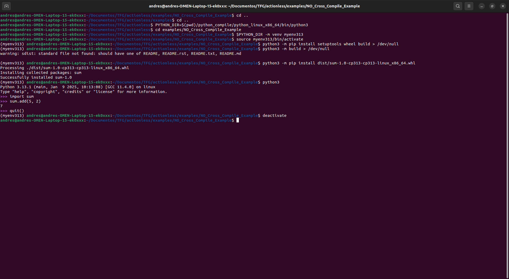

# Example of Compiling a Python Package in C Without Cross-Compilation

## 1. **Creating a Virtual Environment**
This step is optional but recommended to avoid conflicts with other packages installed on the system.

First, we create and activate a virtual environment named `myenv313` using Python 3.13.1 located at a custom path:

```bash
cd ..
cd ..
PYTHON_DIR=$(pwd)/python_compile/python_linux_x86_64/bin/python3
cd examples/NO_Cross_Compile_Example
$PYTHON_DIR -m venv myenv313
source myenv313/bin/activate
```

## 2. **Installing Required Dependencies**
With the virtual environment active, install the tools needed to build the package: `setuptools`, `wheel`, and `build`.

```bash
python3 -m pip install setuptools wheel build
```

## 3. **Building the Package**
Run the command to build the Python package, redirecting the output to `/dev/null` to avoid unnecessary information:

```bash
python3 -m build
```

## 4. **Installing the Generated Package**
The package generated in the previous step is located in the `dist/` directory. Install the package using pip:

```bash
python3 -m pip install dist/sum-1.0-cp313-cp313-linux_x86_64.whl
```

## 5. **Testing the Installed Package**
Run Python within the virtual environment to test the installed package:

```bash
python3
```

Inside the Python interpreter:

```python
>>> import sum
>>> sum.add(5, 2)
7
>>> quit()
```

This confirms that the package works correctly within the configured virtual environment. The environment can be deactivated when no longer needed by running:

```bash
deactivate
```

## Screenshot of the Example

