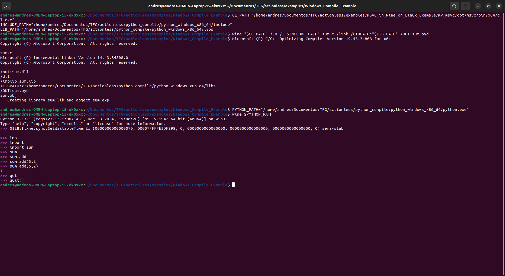

# Compiling a Python Package for Windows using Wine

## Requirements
To compile a Python package for Windows using Wine, you will need:
- **Microsoft Visual C++ (MSVC)**: Required for compiling the C code.
- **Python for Windows**: Needed to run the compiled module inside Wine.
- **Wine**: Allows running Windows programs (like MSVC and Python) on Linux.

## Define paths for the compiler, includes, libraries, and Python executable
```bash
CL_PATH="/home/andres/Documentos/TFG/actionless/examples/MSVC_in_Wine_on_Linux_Example/my_msvc/opt/msvc/bin/x64/cl.exe"
INCLUDE_PATH="/home/andres/Documentos/TFG/actionless/python_compile/python_windows_x86_64/include"
LIB_PATH="/home/andres/Documentos/TFG/actionless/python_compile/python_windows_x86_64/libs"
PYTHON_PATH="/home/andres/Documentos/TFG/actionless/python_compile/python_windows_x86_64/python.exe"
```

## Compile sum.c into a shared library (DLL) using MSVC inside Wine
```bash
wine "$CL_PATH" /LD /I"$INCLUDE_PATH" sum.c /link /LIBPATH:"$LIB_PATH" /OUT:sum.pyd
```

## Run Python inside Wine to test the compiled module
```bash
wine $PYTHON_PATH
```

```python
>>> import sum
>>> sum.add(5, 2)
7
>>> quit()
```

## Screenshot of the Example

